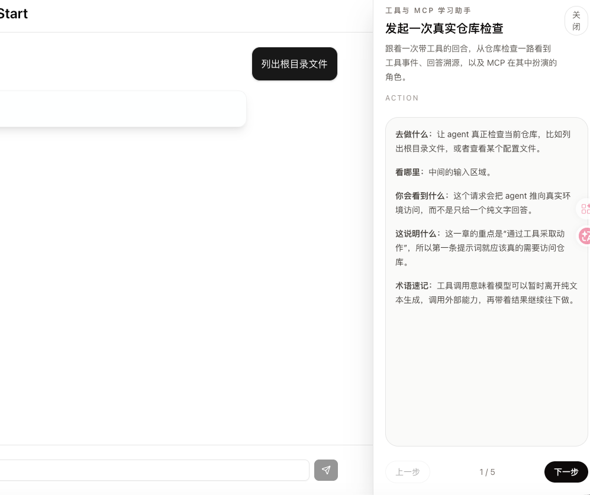
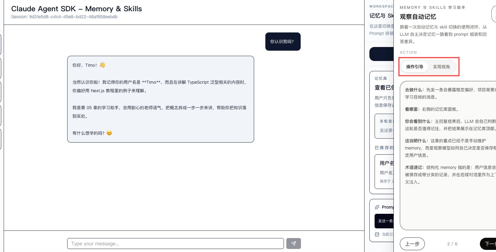
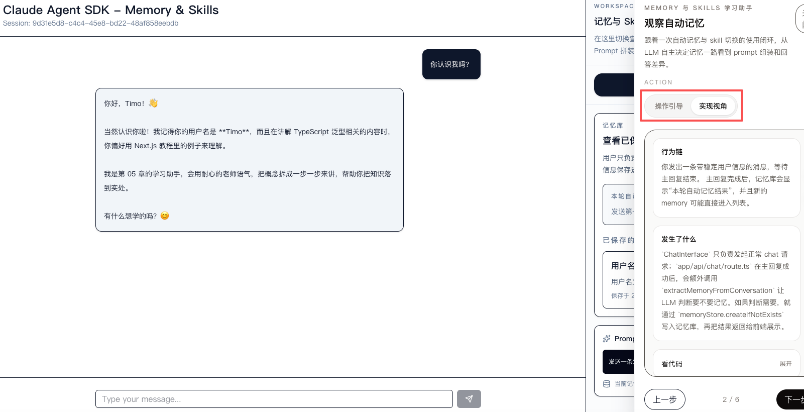

# Learn-agent-from-cases

[](https://github.com/AwhiteV/Learn-agent-from-cases/stargazers)
[](https://github.com/AwhiteV/Learn-agent-from-cases/network/members)
[](https://github.com/AwhiteV/Learn-agent-from-cases/blob/main/LICENSE)
[](https://github.com/AwhiteV/Learn-agent-from-cases)
[](https://claude.ai/code)
[](https://platform.claude.com/docs/en/agent-sdk/typescript)

🌐 **Language / 语言**: **中文** | [English](./README.en.md)

一个面向初学者的中文优先教程仓库，帮助你从“第一次接触 Agent SDK”走到“理解面向产品的 Agent 架构”。

## 这套教程适合谁

如果你符合下面任意几项，这套教程就是为你准备的：

- 你会基础的 JavaScript / TypeScript，最好也了解一点 React。
- 如果你暂时没有代码基础，也不用担心；你可以使用任意一个 AI coding 工具克隆这个项目，并让它帮助你安装依赖、配置环境变量和启动项目，再跟着章节一步步学习。
- 你用过大模型 API，但还没有真正建立 Agent SDK 的心智模型。
- 你不想只看概念说明，更想通过“跑起来、改一改、观察结果”来学习。
- 你想从单个聊天 Agent，逐步走到更接近真实产品的 Agent 应用结构。
- 你未来想参与类似 Proma 的项目，或者自己做一个 Agent 产品原型。

如果你已经是非常熟悉 Agent SDK 的重度用户，这个仓库依然可以作为“从教学角度回看架构演进”的参考，但它首先服务的是新手学习路径。

## 你会如何学习这个仓库

推荐把这套教程当成一条连续的学习路线，而不是一次性通读所有目录：

1. 先从 `00` 或 `01` 开始，建立 session、workspace、streaming 的第一印象。
2. 每学一章，先运行，再做 1-2 个小实验，最后回头读该章 README。
3. 遇到新概念时，先理解“它解决什么问题”，再看“它是怎么实现的”。
4. 不要急着一口气跳到多 Agent、memory 或 multi-provider；这些能力建立在前面的心智模型上。
5. 每一章结束后，用自己的话回答两个问题：
   - 这一章里的 Agent 比上一章多了什么能力？
   - 这个能力为什么会在真实产品里出现？

### 给初学者的实用学习节奏

- 第 1 遍：只跑项目，观察输入、输出、事件流和 UI 变化。
- 第 2 遍：带着 README 的问题清单，或者直接跟着页面里的“学习助手”抽屉再操作一次，确认自己知道“该看哪里”。
- 第 3 遍：修改 prompt、工具配置或交互流程，验证你对系统行为的理解。

从 `01` 章开始，Web 章节页面右下角都会提供一个“学习助手”入口。打开后会以页面内浮层 / 抽屉的形式，告诉你当前章节推荐先点哪里、输入什么、观察什么，以及相关的简短概念解释。建议第一次学习时先按抽屉步骤走一遍，第二次再脱离引导独立操作。

## 页面内学习助手

从 `01` 到 `04`，每个 Web 章节都已经内置了“学习助手”抽屉。它不是额外的文档页，而是直接出现在章节页面里的运行时引导层，适合你一边操作、一边理解当前案例到底想让你观察什么。



现在 `05` 和 `06` 章节里的学习助手还支持双模式切换：

- `操作引导`：适合第一次跑案例，按步骤告诉你先点哪里、发什么消息、重点看什么反馈。
- `实现视角`：适合已经跑通过一次案例之后，回看关键文件、函数职责和数据流，把页面行为和代码实现对起来。





你可以把它理解成“章节内的实验教练”，它会帮你完成这几件事：

- 告诉你当前这一步建议先点击哪里、输入什么。
- 提醒你应该重点观察哪个区域，比如聊天流式输出、工具活动、权限面板或 teammate 状态。
- 用很短的概念解释，把“这个现象为什么重要”一起讲清楚。
- 在你第一次跑 demo 时，降低“页面已经打开了，但我不知道下一步看什么”的迷路感。

推荐用法是：

1. 第一次学习某一章时，先跟着抽屉步骤完整走一遍。
2. 第二次再关闭抽屉，自己独立复现一次。
3. 如果中途忘了该看哪里，就用右下角入口重新打开。

## 00-06 学习地图

下面这张表把当前教程路线、Agent SDK 概念映射、以及受 Proma 启发的产品能力映射放在一起。`05-memory-and-skills` 和 `06-remote-and-multi-provider` 现在都已经是可运行章节。

| 章节 | 当前状态 | 这一章你会构建什么 | 重点 Agent SDK 概念 | 对应的产品能力映射 |
| --- | --- | --- | --- | --- |
| [`00-playground`](./00-playground) | 已存在 | 一个最小 CLI Playground，用最少代码体验 prompt、工具开关与输出模式 | 基础 prompting、工具调用观察、最小运行闭环 | “先看行为再谈架构”的实验场 |
| [`00-playground-v2`](./00-playground-v2) | 已存在 | 一个更贴近新 Session API 的 CLI 实验台，用来理解 session 的创建、恢复与继续对话 | `unstable_v2_createSession`、`unstable_v2_resumeSession`、`unstable_v2_prompt`、session 生命周期 | 产品原型前的心智模型训练场 |
| [`01-quick-start`](./01-quick-start) | 已存在 | 第一个可用的 Web Agent，包含会话持久化、工作区绑定、流式界面和章节学习助手抽屉 | sessions、workspace、streaming UI、context persistence | 从 demo 走向“可使用的聊天工作台” |
| [`02-tools-and-mcp`](./02-tools-and-mcp) | 已存在 | 一个能真正调用工具、展示工具活动，并用学习助手引导你观察关键节点的 Agent 应用 | tools、tool lifecycle、MCP、事件可视化 | 让 Agent 从“会回答”升级到“会行动” |
| [`03-agent-with-permission`](./03-agent-with-permission) | 已存在 | 一个带审批与拦截流程，并通过学习助手带你练习 Allow / Deny / AskUserQuestion 的 Agent 应用 | permissions、`canUseTool`、`PermissionMode`、`AskUserQuestion` | 面向用户场景的安全控制层 |
| [`04-agent-teams`](./04-agent-teams) | 已存在 | 一个支持 orchestrator/subagent 协作，并提供章节内学习助手来解释团队状态视图的多 Agent 示例 | teams、subagents、任务拆解、协作恢复流程 | 从单 Agent 走向多 Agent 编排 |
| [`05-memory-and-skills`](./05-memory-and-skills) | 已存在 | 一个带可视化 memory 面板与 skill 模式切换的学习型 Agent | memory、skills、上下文注入、能力模块化 | 连续体验、个性化与能力复用 |
| [`06-remote-and-multi-provider`](./06-remote-and-multi-provider) | 已存在 | 一个展示远程执行形态与 provider abstraction 的产品化案例 | remote execution、provider abstraction、环境分离 | 更接近真实产品的接入层与部署思维 |

## 每一章到底在往前搭什么

### 00：先理解 Agent 不是“多轮聊天循环”

`00-playground` 和 `00-playground-v2` 都是入门实验场，但定位不同：

- `00-playground` 适合先快速摸到“Agent 跑起来是什么感觉”。
- `00-playground-v2` 适合真正建立 session 心智模型，理解为什么 Agent SDK 不只是你手动维护一个 `messages` 数组。

如果你之前只写过普通的 LLM Chat Demo，这两章会帮你跨过第一道门槛。

### 01：把 Agent 放进一个真正可操作的 Web 应用里

`01-quick-start` 不再只是“能对话”，而是让你看到 workspace、session persistence 和 streaming UI 组合起来之后，一个基础 Agent 应用应该长什么样。

这一章的重点不是页面有多复杂，而是让你感受到：Agent SDK 项目和普通聊天网页在状态管理上完全不是一回事。现在章节页面里也带了“学习助手”抽屉，会直接告诉你应该先发什么消息、看哪里出现新 session、再去哪里理解 workspace。

### 02：给 Agent 接上行动能力

`02-tools-and-mcp` 会把重点从“回答得对不对”转向“它能不能做事，以及你能不能看懂它在做什么”。

这一章里，MCP 不是一个时髦名词，而是帮助你理解“工具为什么应该被标准化接入”的入口；工具活动可视化也不是装饰，而是学习 Agent 行为最直接的窗口。学习助手抽屉会按顺序带你看工具调用、活动列表和最终回答之间的关系，减少第一次上手时的迷路感。

### 03：让 Agent 变得可控

当 Agent 开始有行动能力，权限控制就不再是附加项。`03-agent-with-permission` 会帮你理解，为什么 permissions、审批、拒绝、AskUserQuestion 这些流程，本质上是在给 Agent 产品补安全基础设施。对应的学习助手抽屉也会引导你先做一次 Deny，再做一次 Allow，并观察用户决策是怎样回到正在运行的 Agent 里的。

### 04：理解什么时候值得引入多 Agent

`04-agent-teams` 不是为了证明“多 Agent 一定更高级”，而是帮助你判断：

- 哪类任务值得拆给 subagent。
- orchestrator 应该负责什么，不应该负责什么。
- 多 Agent 协作带来的复杂度是否真的换来了收益。

这一章的学习助手抽屉会重点帮你对照 teammate 状态、任务列表和最终汇总回答，判断这次拆解到底是不是合理。

### 05-06：迈向产品化思维

`05-memory-and-skills` 与 `06-remote-and-multi-provider` 现在都已经进入本系列的可运行章节：

- `05` 已经开始讨论 memory 与即时上下文的区别，以及 skill 如何变成可复用的能力模块。
- `06` 会讨论当 Agent 开始接近真实产品时，为什么 remote execution 与 provider abstraction 会逐渐成为必要层。
- 这两章的学习助手还额外提供 `实现视角`，适合你在已经跑通过案例之后回看关键文件、函数职责和数据流，把“页面上发生了什么”与“代码里为什么这样写”对起来。

所以你现在在根目录里看到的是两章都可以继续往下动手实践的学习路线。

## 如何按仓库现状开始学习

如果你今天就要开始，推荐这样走：

1. 想先理解底层心智模型：从 [`00-playground-v2`](./00-playground-v2) 开始。
2. 想先获得一个可见的 Web 结果：从 [`01-quick-start`](./01-quick-start) 开始。
3. 想重点学习 Agent 为什么能调用外部能力：继续看 [`02-tools-and-mcp`](./02-tools-and-mcp)。
4. 想理解安全与用户确认流程：接着看 [`03-agent-with-permission`](./03-agent-with-permission)。
5. 想理解多 Agent 编排：继续看 [`04-agent-teams`](./04-agent-teams)。
6. 想进一步理解 memory 与 skill 如何影响回答：再看 [`05-memory-and-skills`](./05-memory-and-skills)。
7. 想理解 remote-style 执行与 provider abstraction：最后看 [`06-remote-and-multi-provider`](./06-remote-and-multi-provider)。

`00-playground` 可以插在最前面，当作一个更轻量的预热实验场。

## 这套系列和 Proma 的关系

这套教程受到 [Proma](https://github.com/ErlichLiu/proma-oss.git) 的产品思路启发，尤其是这些方向：

- Agent 不只是聊天窗口，而是一种有状态、有工具、有边界的应用形态。
- 一个能落地的 Agent 产品，往往会逐步需要 tools、permissions、teams、memory、skills 和 provider abstraction。
- 教学最好从“可运行的小案例”开始，而不是直接把完整产品架构甩给学习者。

但这里有一个边界需要说清楚：

- 本仓库不是 Proma 的 1:1 复刻。
- 本仓库不会宣称已经覆盖 Proma 的全部能力。
- 本仓库的目标是帮助你理解“为什么 Proma 一类产品会长成这样”，而不是直接替代 Proma。

你可以把它理解成：Proma 更像产品方向的参照物，而这个仓库是面向学习者的训练路径。

## 快速开始

### 环境准备

- Node.js 18+
- `pnpm`
- 可用的 Anthropic 兼容 API Key

### 推荐起步方式

如果你想先跑 Web 版教程：

```bash
cp .env.local.example .env.local
# 在仓库根目录填写一次 ANTHROPIC_API_KEY
# 如需切换支持该配置的章节默认模型，可额外填写 ANTHROPIC_MODEL
cd 01-quick-start
pnpm install
pnpm dev
```

如果你想先跑 CLI 实验场：

```bash
cd 00-playground-v2
pnpm install
cp .env.example .env.local
pnpm play
```

`01` 到 `06` 章节现在都会默认复用仓库根目录的 `.env.local`，所以不需要每学一章都重新复制一次环境变量文件；如果某一章确实需要单独覆盖，也仍然可以在该章节目录下放自己的 `.env.local`。每个章节自己的 README 会继续说明该章的启动方式和建议实验步骤。

## 仓库结构

当前磁盘上已经存在的教程目录如下：

```text
00-playground/
00-playground-v2/
01-quick-start/
02-tools-and-mcp/
03-agent-with-permission/
04-agent-teams/
05-memory-and-skills/
06-remote-and-multi-provider/
```

## 学习时特别值得关注的概念

整套系列会反复围绕这些 Agent SDK / 产品概念展开：

- sessions：为什么 Agent 应用需要持续会话，而不只是请求响应。
- tools：为什么“会调用工具”会改变 Agent 的边界。
- MCP：为什么工具接入要标准化，而不是一直硬编码。
- permissions：为什么用户授权和拦截是 Agent 产品的基础设施。
- teams：为什么有些任务适合被拆分成多 Agent 协作。
- memory：为什么连续体验不等于无限追加聊天历史。
- skills：为什么可复用能力模块比一次性 prompt 更适合扩展。
- provider abstraction：为什么真实产品不会永远绑定单一模型提供方。

## 相关资源

- [Claude Agent SDK 官方文档](https://platform.claude.com/docs/en/agent-sdk/typescript)
- [Anthropic API 文档](https://docs.anthropic.com/)
- [MiniMax API 文档](https://platform.minimaxi.com/docs/guides/text-generation)
- [Proma](https://github.com/ErlichLiu/proma-oss.git)

## 贡献说明

欢迎通过 Issue 和 PR 一起完善这套教程。对本仓库的任何结构性修改，请同步更新对应目录下的 `AGENTS.md`，保证文档与代码状态一致。
